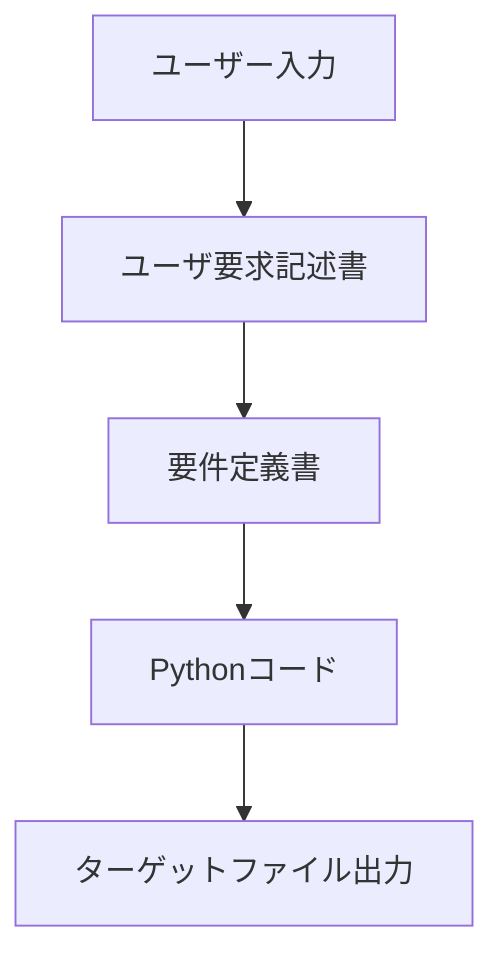

# Zoltraak プロジェクトの全体像

## 処理の流れ



### コードマップ

どんな処理をするのか、どこにあるのか、どのように関わり合っているのか

### [MarkdownToPythonConverter](docs/designs/MarkdownToPythonConverter.md)

- ユーザーはプロンプトや Markdown ファイルを入力します。この入力に基づいて処理が開始されます。

- 入力された Markdown ファイルやプロンプトを元に、要件定義書を生成し、必要に応じてターゲットファイルを作成します。

### [TargetCodeGenerator](docs/designs/TargetCodeGenerator.md)

- 生成された要件定義書を基に、ターゲットファイルに Python コードを生成します。

## 用語

### ユーザ要求

「本を書きたい」などの一般的なプロンプトです。

### ユーザ要求記述書

ユーザ要求から統一された規格に整形した Markdown ファイルです。
この時点ではプロジェクト特性は考慮されません。

目的

- ユーザ要求の情報量が多すぎたり少なすぎたりしても安定して動作させる
- 無駄なユーザ要求や重複を解消する

### 要件定義書

曖昧さが排除された抽象的な状態の Markdown ファイルです。

目的

- プロジェクトの特性に合った内容を構成する

特徴

- 成果物(python や java)との直接的な関係性（リンク）を管理しない
- 成果物の形式(python や java)の情報を段階的に含む

### ターゲットファイル

python ファイルと対応するマークダウン形式の設計書です。

目的

- python ファイルなどの最終的な成果物の品質や状態を管理する
- 効率的に成果物の差分更新や品質向上ができる

他の用語は[こちら](docs/configuration.md)

## 出力フォルダのファイル構成(work フォルダで実行した場合)

### ユーザ要求(例)

本を書きたい

```
work
├── generated
│   ├── requirements
│   │   └── zoltraak_pre_process.py
│   └── zoltraak_pre_process
│       ├── README.md
│       └── pre_process.py
├── past_md_files
│   └── zoltraak_pre_process.md
├── past_prompt_files
└── requirements
    └── zoltraak_pre_process.md
```

### ユーザ要求記述書(例)

作成中

### 要件定義書(例)

requirements/zoltraak_pre_process.md

### ターゲットファイル作成用コード(例)

generated/requirements/zoltraak_pre_process.py

複数のターゲットファイルを順次作成するための python ファイル

### ターゲットファイル(例)

generated/zoltraak_pre_process/README.md
generated/zoltraak_pre_process/pre_process.py

要件定義書により最終的に出力されたファイル群

### その他

past_md_files: 要件定義書のバックアップ
past_prompt_files: ターゲットファイルのバックアップ
