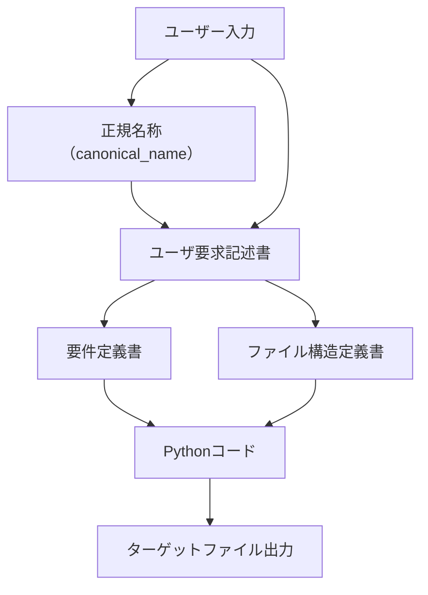
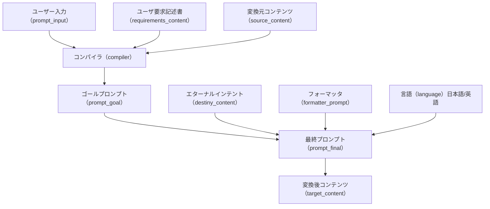

# Zoltraak プロジェクトの全体像

## 処理の流れ



## コードマップ

どんな処理をするのか、どこにあるのか、どのように関わり合っているのか

### [MarkdownToPythonConverter](docs/designs/MarkdownToPythonConverter.md)

- ユーザーはプロンプトや Markdown ファイルを入力します。この入力に基づいて処理が開始されます。

- 入力された Markdown ファイルやプロンプトを元に、要件定義書を生成し、必要に応じてターゲットファイルを作成します。

### [TargetCodeGenerator](docs/designs/TargetCodeGenerator.md)

- 生成された要件定義書を基に、ターゲットファイルに Python コードを生成します。

## コアアーキテクチャ

Zoltraak のコアは以下の２つのコンポーネントで構成されている。

- コンバータ(source⇒target の変換ロジック)
- ジェネレータ(要件定義書から複数のソースファイルを生成)

### コンバータ

Zoltraak のコアは source⇒target の変換ロジックにある。
以下のロジックで効率的に変換する。

#### 前提(コンバータ)

- canonical_name とレイヤで一意に決まる source ファイルがある(source_org と仮称)
- 変換に影響するインプット(これらが一致すればスキップできる)
  - canonical_name(=>source_org が一意に決まる)
  - プロンプト(ユーザ要求 or ユーザ要求記述書)
  - コンテキスト(その他の変換に影響する要素をプロンプトに含める設計)
  - グリモア(compiler, formatter, architect)

#### ロジック(コンバータ)

1. source_org を確定する(基本的には前レイヤの target ファイル)
2. プロンプト＋ source_org ＋各種コンテキストなどを詰め込んで最終プロンプトを生成する
3. 初回は最終プロンプトから target ファイルを生成する
4. 2 回目以降は最終プロンプトの差分を target ファイルに適用する
5. (差分適用ロジック)
   1. 最終プロンプトに差分がなければスキップする
   2. source_org に差分があれば、最終プロンプト + source_org の差分 のプロンプトを利用する
   3. source_org の差分が大きすぎる場合や、適用結果に異常があれば、初回と同じように最終プロンプトだけを利用する
   4. source_org に差分がない(プロンプト等が変化した)場合は、初回と同じように最終プロンプトだけを利用する

#### 処理の流れ(コンバータ)

最重要なのはプロンプト構築ロジック。



### ジェネレータ

#### 前提(ジェネレータ)

- ジェネレータの本体は architect.md
- 要件定義書からファイルを生成する
- ファイル構造定義書を元にファイルを削除する

#### ロジック(ジェネレータ)

1. 要件定義書と architect.md から python スクリプトを作成する
2. python スクリプトを実行する(新規作成 or 更新)
3. ファイル構造定義書と architect.md から python スクリプトを作成する
4. python スクリプトを実行する(削除)

## 用語

### ユーザ要求

「本を書きたい」などの一般的なプロンプトです。

### 正規名称(canonical_name)

アウトプットファイルやフォルダを一意に識別するための正規名称です。

### ユーザ要求記述書

ユーザ要求から統一された規格に整形した Markdown ファイルです。
この時点ではプロジェクト特性は考慮されません。

目的

- ユーザ要求の情報量が多すぎたり少なすぎたりしても安定して動作させる
- 無駄なユーザ要求や重複を解消する

### 要件定義書

曖昧さが排除された抽象的な状態の Markdown ファイルです。

目的

- プロジェクトの特性に合った内容を構成する

特徴

- 成果物(python や java)との直接的な関係性（リンク）を管理しない
- 成果物の形式(python や java)の情報を段階的に含む

### ファイル構造定義書

ジェネレータが生成するべき全ファイルの完全なリストです。
このファイルに存在しないものは削除されます。

### ターゲットファイル

python ファイルと対応するマークダウン形式の設計書です。

目的

- python ファイルなどの最終的な成果物の品質や状態を管理する
- 効率的に成果物の差分更新や品質向上ができる

他の用語は[こちら](docs/configuration.md)

## 出力フォルダのファイル構成(work フォルダで実行した場合)

### ユーザ要求(例)

本を書きたい

```
work
├── generated
│   ├── requirements
│   │   └── zoltraak_pre_process.py
│   └── zoltraak_pre_process
│       ├── README.md
│       └── pre_process.py
├── past_md_files
│   └── zoltraak_pre_process.md
├── past_prompt_files
└── requirements
    └── zoltraak_pre_process.md
```

### ユーザ要求記述書(例)

作成中

### 要件定義書(例)

requirements/zoltraak_pre_process.md

### ターゲットファイル作成用コード(例)

generated/requirements/zoltraak_pre_process.py

複数のターゲットファイルを順次作成するための python ファイル

### ターゲットファイル(例)

generated/zoltraak_pre_process/README.md
generated/zoltraak_pre_process/pre_process.py

要件定義書により最終的に出力されたファイル群

### その他

past_md_files: 要件定義書のバックアップ
past_prompt_files: ターゲットファイルのバックアップ
