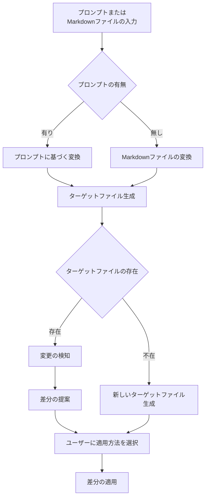

# MarkdownToPythonConverter 概要

`MarkdownToPythonConverter` は、Markdown ファイルを Python ファイルに変換するためのクラスです。

このクラスは、変換プロセスを管理し、ユーザーのプロンプトに基づいて内容を生成します。



## 主な機能

- **初期化**:

  - コンストラクタでは、以下の入力パラメータを受け取ります：
    - `md_file_path`: 入力する Markdown ファイルのパス。
    - `py_file_path`: 出力する Python ファイルのパス。
    - `developer`: 開発者名または発表者名。
    - `model_name`: 使用するモデルの名前。
    - `prompt`: 変換に使用する追加のプロンプト（任意）。
    - `compiler_path`: 使用するコンパイラーのパス（任意）。
    - `formatter_path`: 使用するフォーマッターのパス（任意）。
    - `language`: 出力するプログラミング言語（任意）。

- **変換処理**:

  - `convert()` メソッドを呼び出すことで、Markdown ファイルを Python ファイルに変換します。このメソッドは、プロンプトが指定されているかどうかで処理を分岐します。

- **ハッシュ計算**:

  - `calculate_file_hash()` メソッドを使用し、ソースファイルのハッシュ値を計算します。これにより、ファイルの変更を検知し、必要に応じて差分を表示します。

- **ターゲットファイルの処理**:

  - `handle_existing_target_file()` メソッドで、既存のターゲットファイルが存在する場合、その内容を読み込み、変更があれば提案します。
  - `handle_new_target_file()` メソッドで、新しいターゲットファイルを生成します。

- **差分の提案と適用**:
  - `propose_target_diff()` メソッドを使用し、変更が必要な部分を提案し、ユーザーに差分を適用する方法を選ばせます。
  - `apply_diff_to_target_file()` メソッドで、提案された差分をターゲットファイルに適用します。

## 入力の種類

このクラスでは、主に以下の 2 種類の入力方法があります：

1. **プロンプト入力**:

   - ユーザーが曖昧な要求を直接入力します。例:
     ```bash
     zoltraak "本を書きたい"
     ```
   - この場合、初期の Markdown ファイルが生成され、要件定義書を作成するための基盤となります。

2. **Markdown ファイル入力**:
   - 既存の Markdown ファイルを指定することができます。例:
     ```bash
     zoltraak input.md
     ```
   - 指定された Markdown ファイルの内容に基づいて、Python ファイルが生成されます。

## 出力

変換処理の結果、生成される出力は以下の通りです：

- **Markdown ファイル**: `gen*def*{goal}.md` の形式で生成され、要件定義書が含まれます。
